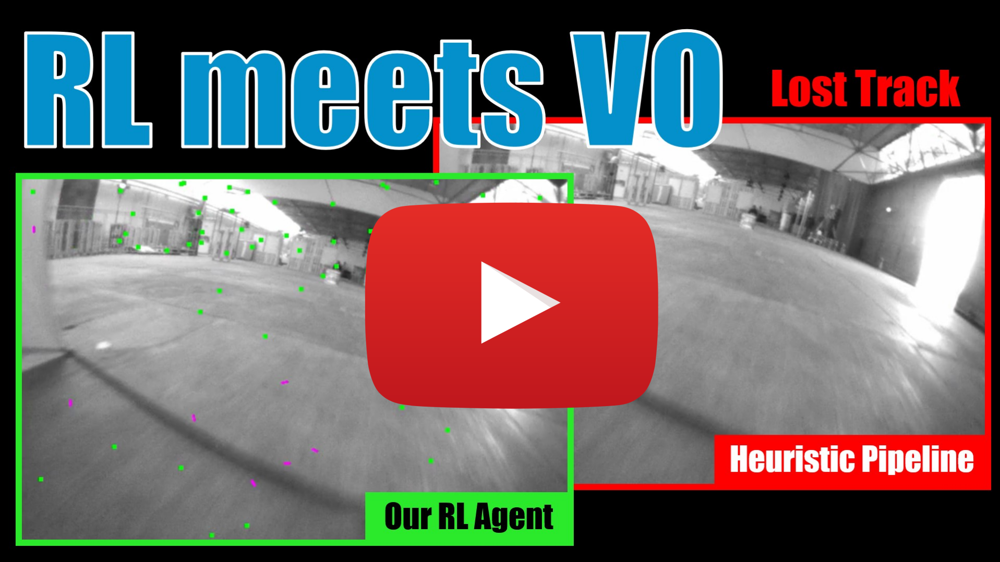

# Reinforcement Learning Meets Visual Odometry

<p align="center">
 <a href="https://youtu.be/pt6yPTdQd6M">
  
 </a>
</p>

This is the code for the ECCV24 paper **Reinforcement Learning Meets Visual Odometry**
([PDF](https://rpg.ifi.uzh.ch/docs/ECCV24_Messikommer.pdf)) by [Nico Messikommer*](https://messikommernico.github.io/), [Giovanni Cioffi*](https://giovanni-cioffi.netlify.app/), [Mathias Gehrig](https://magehrig.github.io/), and [Davide Scaramuzza](http://rpg.ifi.uzh.ch/people_scaramuzza.html).
For an overview of our method, check out our [video](https://youtu.be/pt6yPTdQd6M).

If you use any of this code, please cite the following publication:

```bibtex
@Article{Messikommer24eccv,
  author  = {Nico Messikommer* and Giovanni Cioffi* and Mathias Gehrig and Davide Scaramuzza},
  title   = {Reinforcement Learning Meets Visual Odometry},
  journal = {European Conference on Computer Vision. (ECCV)},
  year    = {2024},
}
```

If you use the SVO library, please do not forget to cite the following publications:

```bibtex
@inproceedings{Forster2014ICRA,
  author = {Forster, Christian and Pizzoli, Matia and Scaramuzza, Davide},
  title = {{SVO}: Fast Semi-Direct Monocular Visual Odometry},
  booktitle = {IEEE International Conference on Robotics and Automation (ICRA)},
  year = {2014}
}
```

```bibtex
@ARTICLE{7782863,
  author={Forster, Christian and Zhang, Zichao and Gassner, Michael and Werlberger, Manuel and Scaramuzza, Davide},
  journal={IEEE Transactions on Robotics}, 
  title={SVO: Semidirect Visual Odometry for Monocular and Multicamera Systems}, 
  year={2017},
  volume={33},
  number={2},
  pages={249-265},
  doi={10.1109/TRO.2016.2623335}}
```

## Abstract

Visual Odometry (VO) is essential to downstream mobile robotics and augmented/virtual reality tasks. 
Despite recent advances, existing VO methods still rely on heuristic design choices that require several weeks of hyperparameter tuning by human experts, hindering generalizability and robustness. 
We address these challenges by reframing VO as a sequential decision-making task and applying Reinforcement Learning (RL) to adapt the VO process dynamically. 
Our approach introduces a neural network, operating as an agent within the VO pipeline, to make decisions such as keyframe and grid-size selection based on real-time conditions. 
Our method minimizes reliance on heuristic choices using a reward function based on pose error, runtime, and other metrics to guide the system. 
Our RL framework treats the VO system and the image sequence as an environment, with the agent receiving observations from keypoints, map statistics, and prior poses. 
Experimental results using classical VO methods and public benchmarks demonstrate improvements in accuracy and robustness, validating the generalizability of our RL-enhanced VO approach to different scenarios. 
We believe this paradigm shift advances VO technology by eliminating the need for time-intensive parameter tuning of heuristics.

## Installation
Below are the instructions to run the RL framework with SVO.

### RL Framework

Go to the directory of the repo (vo_rl/) and run the follwing command:

`docker build -t vo_rl .`

To launch the contain of the built image, first, the paths inside the `launch_container.sh` needs to be adjusted to point to the code, data and log directory.
Once the paths are changed, the following command can be used:

`bash launch_container.sh`

The following commands can be used to install the SVO library:

`cd svo-lib`

`mkdir build && cd build`

`cmake .. && make`

### SVO Library
In addition to the RL framework, there is also a separate dockerfile inside the `svo-lib` directory, which can be used to build the SVO library in a similar way as the RL framework.

## Datasets

The three datasets used in the paper can be downloaded on the respective websites, see below. 
In addition to the data from the official websites, each dataset requires a calibration folder with a yaml file containing the camera intrinsics. 
The yaml file can be separately downloaded from the given links below.

### TartanAir
The TartanAir dataset can be downloaded here:
[TartanAir](https://theairlab.org/tartanair-dataset/)
To speed up the dataloading, we convert the RGB images of the `image_left` directory to grayscale images.

The corresponding yaml file containing the camera intrinsics can be downloaded [here](https://download.ifi.uzh.ch/rpg/ECCV24_VORL/tartan_pinhole.yaml).
It should be placed inside a directory called `calibration`.

The dataset should have the following structure:
```
TartanAir/
├── abandonedfactory/
│   ├── Easy/
│   │   ├── P000/
│   │   │   ├── image_left_gray/
│   │   │   │   ├── 000000_left.jpg
│   │   │   │   ├── ...
│   │   │   ├── pose_left.txt
├──  ...
├── calibration
│   ├── tartan_pinhole.yaml
```

### EuRoC
The EuRoC dataset can be downloaded here:
[EuRoC](https://projects.asl.ethz.ch/datasets/doku.php?id=kmavvisualinertialdatasets)

The corresponding yaml file containing the camera intrinsics can be downloaded [here](https://download.ifi.uzh.ch/rpg/ECCV24_VORL/euroc_mono.yaml).
It should be placed inside a directory called `calibration`.

The dataset should have the following structure:
```
EuRoC/
├── MH_01_easy/
│   ├── mav0/
│   │   ├── cam0/
│   │   │   ├── data.csv
│   │   │   ├── data/
│   │   │   │   ├── 1403636579763555584.png
│   │   │   │   ├── ...
│   │   ├── state_groundtruth_estimate0/
│   │   │   ├── data.csv
│   │   │   ├── sensor.yaml
├──  ...
├── calibration
│   ├── euroc_mono.yaml
```

### TUM-RGBD
The TUM-RGBD dataset can be downloaded here:
[TUM-RGBD](https://vision.in.tum.de/data/datasets/rgbd-dataset/download)

The corresponding yaml file containing the camera intrinsics can be downloaded [here](https://download.ifi.uzh.ch/rpg/ECCV24_VORL/tum.yaml).
It should be placed inside a directory called `calibration`.

The dataset should have the following structure:
```
TUM-RGBD/
├── rgbd_dataset_freiburg1_desk/
│   ├── groundtruth.txt
│   ├── rgb.txt
│   ├── rgb/
│   │   ├── 1305031452.791720.png
│   │   ├── ...
├──  ...
├── calibration
│   ├── tum.yaml
```

## Training
In a first step, set all the necessary training parameters, the path to the dataset, config and logging directory in the `config.py` file.
To use wandb for logging, set the `wandb_logging` variable to `True` and specify the wandb tags and group for the specific training run in `config.py` file.
The wandb initialization is done inside the `ppo.py` file, where the `<entity>` shoud be replaced before running.
To train the model inside the docker container, run the following command by replacing <GPU_ID> with the GPU ID to be used:

`CUDA_VISIBLE_DEVICES=<GPU_ID> python train.py`

## Testing
Before testing the model, set all the necessary testing parameters, the path to the dataset, config and logging directory in the `config_eval.py` file.
To test the model inside the docker container, run the following command by replacing <GPU_ID> with the GPU ID to be used:

`CUDA_VISIBLE_DEVICES=<GPU_ID> python play.py`

To evaluate the performance of the different runs, run the `/evaluation/evaluate_runs.py`.
First, add the paths pointing to the results of the `play.py` script to the corresponding method in the `METHODS` dict inside `evaluate_runs.py`.
Additionally, also specify the `OUT_DIR` in the `evaluate_runs.py` file.
Then, run the following command from the level of the `vo_rl` directory to evaluate the runs:

`python -m evaluation.evaluate_runs`
